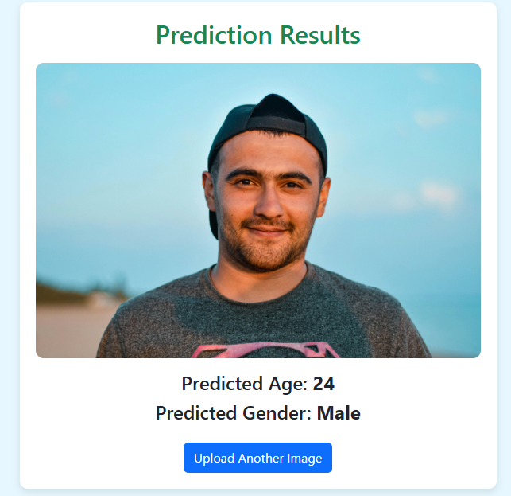
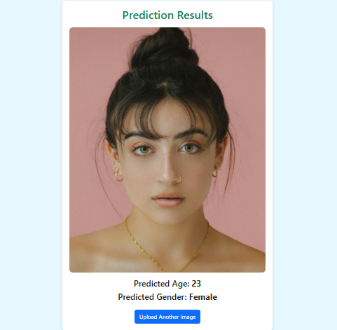

<div align="center">
	
	<h1>🎭 Age & Gender Prediction App</h1>
	<p><b>Real-time age and gender detection using Deep Learning, OpenCV, and a beautiful web GUI.</b></p>
	
</div>

---

## 🚀 Features
- Predicts age and gender from images
- Real-time processing with OpenCV
- Modern, user-friendly web GUI (Flask)
- Demo videos and sample outputs

---
## 🎬 Demo Video

)

Click the image above to watch the demo video.

✅ The video walkthrough includes:
- GUI interface overview
- Model input and output demonstration
- Real-time age and gender prediction
---

## 📦 Project Structure
| File | Description |
|------|-------------|
| `Age_and_Gender_Detection.ipynb` | Core model implementation |
| `app.py` | GUI-based model (Flask) |
| `Code.mp4`, `GUI.mp4` | Demo videos |
| `Output_*.png` | Sample predictions |
| `Age_Sex_Detection.h5` | Pretrained model |

---

## 📋 Requirements


Install with:
```bash
pip install opencv-python tensorflow flask
```

---

## ⚡ Quick Start
1. **Clone this repository**
2. **Open the Colab notebook** (`Age_and_Gender_Detection.ipynb` or `Age_and_Gender_Detection_GUI.ipynb`)
3. **Upload your image**
4. **Run the notebook**
5. **View results instantly!**

### Or run locally:
1. Clone this repository
2. Download the dataset from [UTKFace](https://www.kaggle.com/datasets/jangedoo/utkface-new)
3. Extract the dataset to your repository folder
4. Open the notebook in Jupyter/Colab
5. Run all cells
6. Upload your image and view results

---

## 🎬 Demo

  

  

---

## 🖼️ More Sample Outputs

| Output | Preview |
|--------|---------|
| 1 |  |
| 2 |  |
| 3 |  |
| 4 |  |
| 5 |  |
| 6 |  |

---

## 🙌 Credits
- [UTKFace Dataset](https://www.kaggle.com/datasets/jangedoo/utkface-new)
- [OpenCV](https://opencv.org/)
- [TensorFlow](https://www.tensorflow.org/)
- [Flask](https://flask.palletsprojects.com/)

## 📄 License
This project is licensed under the MIT License.

---

<div align="center">
	<b>🚀 Easy to use and ready to deploy!</b>
</div>

